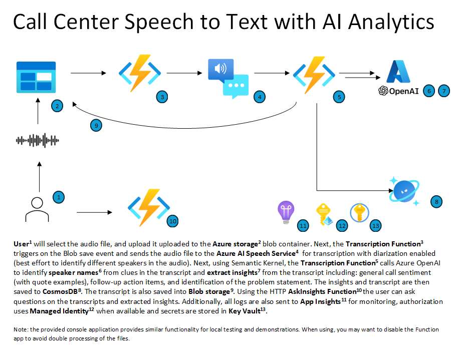
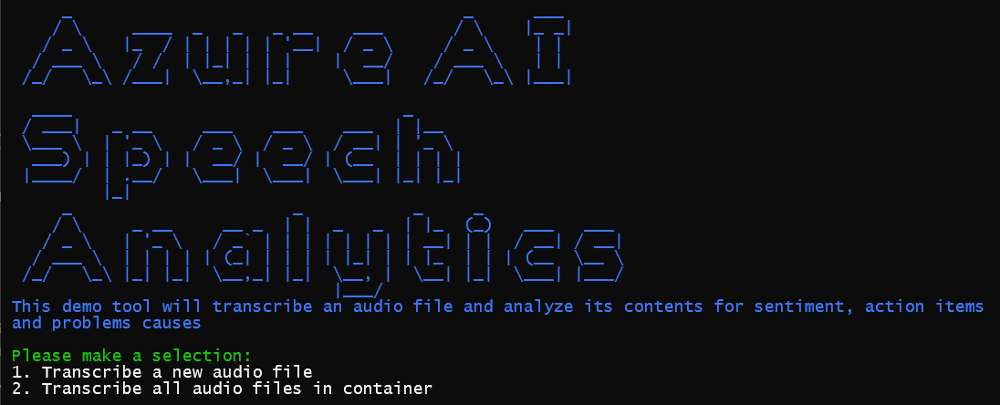

# Speech Analytics Demo
This demo highlights the power of combining Microsoft [AI Services Speech to Text](https://learn.microsoft.com/en-us/azure/ai-services/speech-service/) and [Azure OpenAI](https://azure.microsoft.com/en-us/products/ai-services/openai-service) to transcribe and analyze the content of a call center conversation.



Transcripts also saved to Azure Blob storage and the final results are also displayed in the console.


## Get Started

To simplify the deployment of the demo, we have created Azure Bicep templates and a PowerShell script to deploy the required resources to your Azure subscription. Becuase Azure Open AI resources are not yet available in all regions, you will need to [deploy that on your own](https://learn.microsoft.com/en-us/azure/ai-services/openai/how-to/create-resource?pivots=web-portal) and provide the endpoint and key to the deployment script.

Then, simply login to the Azure CLI and run the deployment script:

``` PowerShell
az login
.\deploy.ps1 -resourceGroup "<rg name>"-location "<azure region>" -aiServicesAcctName "<ai svc name>" -storageAcctName "<storage acct>" -azureOpenAiEndpoint "<exising AOAI endpoint>" -azureOpenAiKey "<existing AOAI key>"
```


## How to use

When you run the app for the first time, select the `1` option to analyze a new call audio file.\
You will be prompted to enter the path to the audio file. The app will then upload the file to Blob storage and start the analysis process.

Alternatively, you can select the `2` option to transcribe and analyze all of the audio files in the Blob storage container.



The app will:
1. Upload the audio file to Blob storage (only for option 1)
2. Start the Speech to Text transcription batch process
3. Poll the transcription process until it is complete
4. Save the transcription results to Blob storage
5. Start the Azure Open AI analysis process which includes:
    - Sentiment analysis
    - Action item extraction
    - Problem statement and root cause determination
6. Save the analysis results to Cosmos DB using the transcription text file as a "CallId" key.

As each step is complete, the app will display the results in the console.

Upon running again, the app will locate any prior transcription results and prompt you to use those or upload a new file.


